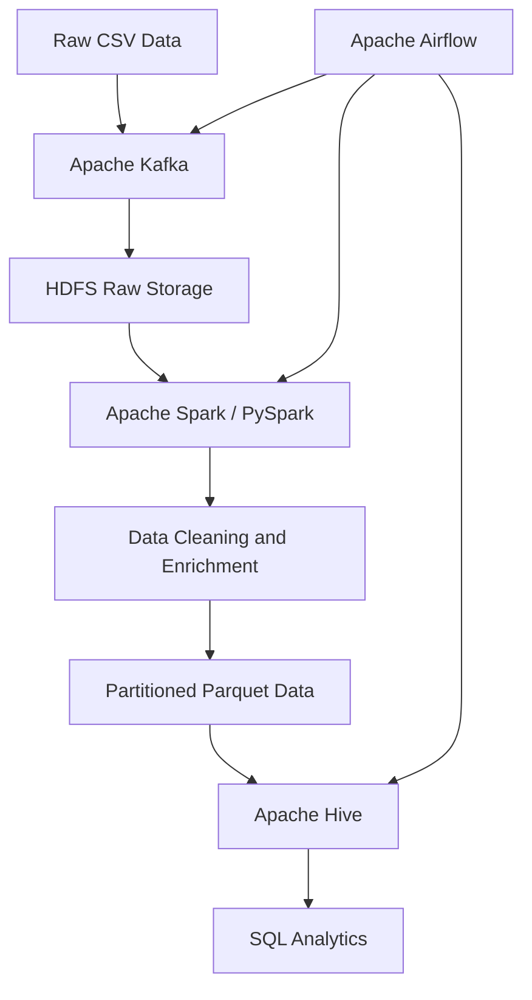

# FMCG Global Sales Data Engineering Pipeline

## 📌 Project Overview

A containerized FMCG Global Sales Data Engineering pipeline that processes **1.1 million sales transactions** using Apache Kafka, HDFS, Apache Spark, Hive, and Airflow.

The pipeline performs data ingestion, distributed storage, data transformation, master-data enrichment, analytics, and data quality validation.

## 🛠️ Technology Stack

| Technology | Purpose |
|---|---|
| Apache Kafka | Data ingestion |
| HDFS | Distributed data storage |
| Apache Spark / PySpark | ETL and data transformation |
| Apache Hive | SQL analytics |
| Apache Airflow | Workflow orchestration |
| Docker | Containerization |
| PowerShell | Local execution |

## 🏗️ Architecture



## 📊 Dataset

- Sales transactions: 1,100,000 records
- Product master data
- Store master data
- Multiple countries and sales channels

## 🔄 Pipeline Workflow

1. Read raw FMCG sales data.
2. Ingest transactions through Kafka.
3. Store raw data in HDFS.
4. Clean and transform data using PySpark.
5. Enrich transactions using product and store master data.
6. Store processed data in partitioned Parquet format.
7. Create Hive tables and partitions.
8. Execute country-level sales analytics.
9. Run data quality checks.
10. Orchestrate the workflow using Airflow.

## 📈 Analytics Results

Country-level sales aggregation was performed using Apache Hive.

The analysis includes:

- Total sales by country
- Total units sold by country
- Country-level sales comparison

## ✅ Data Quality Results

| Check | Result |
|---|---|
| Total records | 1,100,000 |
| NULL values in important columns | 0 |
| Duplicate records | 0 |
| Negative net sales | 0 |
| Negative units sold | 0 |
| Airflow pipeline | Success |

## 📁 Project Structure

```text
FMCG-Data-Engineering/
├── airflow/
├── Data/
├── docker/
├── kafka/
├── Scripts/
├── spark/
├── create_sales.sql
├── data_quality_check.py
├── docker-compose.yml
└── README.md
```

## 🚀 Key Features

- Distributed data storage using HDFS
- Kafka-based data ingestion
- Scalable ETL using PySpark
- Product and store data enrichment
- Partitioned Parquet storage
- Hive SQL analytics
- Airflow workflow orchestration
- Data quality validation
- Docker-based execution

## 🔮 Future Enhancements

- Add automated data quality task to Airflow
- Add dashboard using Tableau or Power BI
- Implement incremental data processing
- Add monitoring and alerting
- Deploy the pipeline to a cloud environment

## 👨‍💻 Author

**Atharv Umate**

Aspiring Data Engineer | Big Data Analytics
