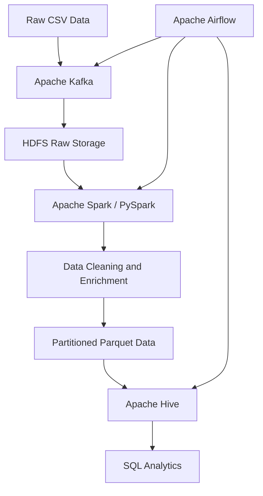

<<<<<<< HEAD
# FMCG Global Sales Data Engineering Pipeline

## 📌 Project Overview

A containerized FMCG Global Sales Data Engineering pipeline that processes **1.1 million sales transactions** using Apache Kafka, HDFS, Apache Spark, Hive, and Airflow.

The pipeline performs data ingestion, distributed storage, data transformation, master-data enrichment, analytics, and data quality validation.

## 🛠️ Technology Stack

| Technology | Purpose |
|---|---|
| Apache Kafka | Data ingestion |
| HDFS | Distributed data storage |
| Apache Spark / PySpark | ETL and data transformation |
| Apache Hive | SQL analytics |
| Apache Airflow | Workflow orchestration |
| Docker | Containerization |
| PowerShell | Local execution |

## 🏗️ Architecture



## 📊 Dataset

- Sales transactions: 1,100,000 records
- Product master data
- Store master data
- Multiple countries and sales channels

## 🔄 Pipeline Workflow

1. Read raw FMCG sales data.
2. Ingest transactions through Kafka.
3. Store raw data in HDFS.
4. Clean and transform data using PySpark.
5. Enrich transactions using product and store master data.
6. Store processed data in partitioned Parquet format.
7. Create Hive tables and partitions.
8. Execute country-level sales analytics.
9. Run data quality checks.
10. Orchestrate the workflow using Airflow.

## 📈 Analytics Results

Country-level sales aggregation was performed using Apache Hive.

The analysis includes:

- Total sales by country
- Total units sold by country
- Country-level sales comparison

## ✅ Data Quality Results
=======
# FMCG Global Sales Data Engineering Project

## Project Overview

This project implements a containerized data engineering pipeline for processing and analyzing FMCG global sales data.

The pipeline ingests sales transactions through Apache Kafka, stores raw data in HDFS, processes data using Apache Spark, and performs analytics using Apache Hive.

## Technologies Used

- Apache Kafka – Data ingestion
- HDFS – Distributed data storage
- Apache Spark / PySpark – ETL and data processing
- Apache Hive – SQL analytics
- Apache Airflow – Workflow orchestration
- Docker – Containerization
- Python – Data engineering scripts

## Architecture

CSV Dataset → Kafka → HDFS → Spark ETL → Parquet → Hive → Analytics

Apache Airflow orchestrates the pipeline workflow.

## Dataset

- Approximately 1.1 million sales transactions
- 102 unique products
- 13 stores
- Multiple countries

## Pipeline Workflow

1. Read sales data from CSV.
2. Publish records to Apache Kafka.
3. Consume Kafka messages and store raw data in HDFS.
4. Process data using Apache Spark.
5. Store processed data in Parquet format.
6. Load processed data into Apache Hive.
7. Execute country-level sales analytics.
8. Orchestrate the workflow using Apache Airflow.

## Data Quality Results
>>>>>>> d32a1c5 (Initial FMCG data engineering pipeline)

| Check | Result |
|---|---|
| Total records | 1,100,000 |
<<<<<<< HEAD
| NULL values in important columns | 0 |
| Duplicate records | 0 |
| Negative net sales | 0 |
| Negative units sold | 0 |
| Airflow pipeline | Success |

## 📁 Project Structure

```text
FMCG-Data-Engineering/
=======
| Null dates | 0 |
| Null store IDs | 0 |
| Null SKU IDs | 0 |
| Null units sold | 0 |
| Null net sales | 0 |
| Duplicate records | 0 |
| Negative net sales | 0 |
| Negative units sold | 0 |

## Project Structure

```text
C-FMCG-Data-Engineering/
>>>>>>> d32a1c5 (Initial FMCG data engineering pipeline)
├── airflow/
├── Data/
├── docker/
├── kafka/
├── Scripts/
├── spark/
├── create_sales.sql
├── data_quality_check.py
├── docker-compose.yml
└── README.md
```

<<<<<<< HEAD
## 🚀 Key Features

- Distributed data storage using HDFS
- Kafka-based data ingestion
- Scalable ETL using PySpark
- Product and store data enrichment
- Partitioned Parquet storage
- Hive SQL analytics
- Airflow workflow orchestration
- Data quality validation
- Docker-based execution

## 🔮 Future Enhancements

- Add automated data quality task to Airflow
- Add dashboard using Tableau or Power BI
- Implement incremental data processing
- Add monitoring and alerting
- Deploy the pipeline to a cloud environment

## 👨‍💻 Author

**Atharv Umate**

Aspiring Data Engineer | Big Data Analytics
=======
## Key Outcomes

- Processed approximately 1.1 million sales records.
- Stored raw and processed data in HDFS.
- Used Spark for ETL and Parquet generation.
- Performed analytics using Hive SQL.
- Automated the pipeline using Apache Airflow.
- Completed data quality validation successfully.

## Future Enhancements

- Add real-time monitoring dashboards.
- Integrate Tableau or Power BI.
- Add automated data quality tasks to Airflow.
- Deploy the pipeline on cloud infrastructure.

## Author

Atharv Umate
>>>>>>> d32a1c5 (Initial FMCG data engineering pipeline)
